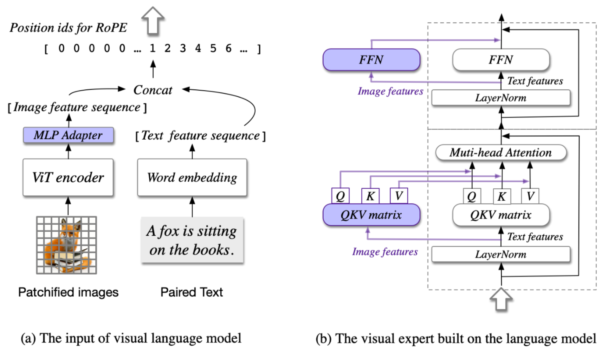

本文对应代码：[https://github.com/tongxiao2002/vllm-for-LMMS](https://github.com/tongxiao2002/vllm-for-LMMS)

由于本文代码相比上一篇文章较为复杂，所以就不在文中贴出代码块，改为解释过程中穿插代码的 URL，所有代码 URL 都会**精确到行**。

## 前言

[上一篇文章](https://tongxiao2002.github.io/posts/adapt-llavar-to-vllm/)讲了怎么将 `LLaVAR` 这种：

1. 模型结构在 `vllm` 库中已经存在的模型；
2. 但公开的 checkpoints 和 config 与 `vllm` 中实现的模型结构不相同

的模型对 `vllm` 进行适配。本质上，在上一篇文章中我们仅完成了[`vllm` 官网](https://docs.vllm.ai/en/latest/models/adding_model.html)上给出的增加自定义模型的 4 个步骤：

1. 将自定义模型的 `forward` 函数接口（通常为 `huggingface-transformers` 的接口）改为 `vllm` 的通用接口：
2. （可选）将自定义模型中的 Linear Layer 以及 Embedding 等改为支持 tensor paralellism 的形式，比如 `vllm` 中提供的 `QKVParallelLinear`, `VocabParallelEmbedding` 等等，不然没法通过 tensor parallelism 进行多卡推理加速。如果模型本身特别大，比如 `Llama-3-70B` 这种，那就必须要实现这一步，不然一张卡塞不下整个模型。
3. 重写 `load_weights` 函数，用于从 checkpoints 中加载参数到模型中。
4. 注册模型，让 `vllm.LLM` 能够识别自定义模型并执行。

中的第3、4步，第1、2步由于 `vllm` 库已经实现了 `LLaVA` 模型的结构因此没有涉及。

今天这篇文章就是以适配 [`Qwen-VL`](https://huggingface.co/Qwen/Qwen-VL-Chat) 以及 [`CogVLM2`](https://huggingface.co/THUDM/cogvlm2-llama3-chat-19B) 模型作为示例来完成第1、2步。

## Qwen-VL

GitHub Repo: [https://github.com/QwenLM/Qwen-VL](https://github.com/QwenLM/Qwen-VL)

HuggingFace Repo: [https://huggingface.co/Qwen/Qwen-VL-Chat](https://huggingface.co/Qwen/Qwen-VL-Chat)

### 模型架构修改

[Qwen-VL](https://huggingface.co/Qwen/Qwen-VL-Chat) 模型本质上就是一个视觉模块拼接上 `Qwen-7B` 模型，而 `Qwen-7B` 模型也是 `vllm` 原生支持的，因此我们要做的就是基于 `vllm` 实现的 `QwenLMHeadModel` 加一个视觉模块就完事了。

如[代码](https://github.com/tongxiao2002/vllm-for-LMMS/blob/main/lmm_modeling/qwen_vl/modeling_qwen_vl.py#L16)所示，以 `QwenModel` 为基类新建 `QwenVLModel`，并加入 vision module，同时也要以 `QwenLMHeadModel` 为基类新建 `QwenVLLMHeadModel`，目的是将其中的 [`transformer`](https://github.com/tongxiao2002/vllm-for-LMMS/blob/main/lmm_modeling/qwen_vl/modeling_qwen_vl.py#L82) 改为 `QwenVLModel`。我选择在 `QwenModel` 中加入 vision module，而不是选择加入到最顶层的 `QwenLMHeadModel`，主要原因有两点：

1. `Qwen-VL-Chat` checkpoints 中 vision module 就位于 `QwenModel` 这一层级中，因此基于 `QwenModel` 加入 vision module 可以免去重写 `load_weights` 函数的麻烦：
    ```json
    {
        "transformer.visual.transformer.resblocks.0.attn.in_proj.bias": "pytorch_model-00008-of-00010.bin",
        "transformer.visual.transformer.resblocks.0.attn.in_proj.weight": "pytorch_model-00008-of-00010.bin",
        "transformer.visual.transformer.resblocks.0.attn.out_proj.bias": "pytorch_model-00008-of-00010.bin",
        "transformer.visual.transformer.resblocks.0.attn.out_proj.weight": "pytorch_model-00008-of-00010.bin",
        "transformer.visual.transformer.resblocks.0.ln_1.bias": "pytorch_model-00008-of-00010.bin",
        "transformer.visual.transformer.resblocks.0.ln_1.weight": "pytorch_model-00008-of-00010.bin",
        "transformer.visual.transformer.resblocks.0.ln_2.bias": "pytorch_model-00008-of-00010.bin",
        "transformer.visual.transformer.resblocks.0.ln_2.weight": "pytorch_model-00008-of-00010.bin",
        "transformer.visual.transformer.resblocks.0.mlp.c_fc.bias": "pytorch_model-00008-of-00010.bin",
        "transformer.visual.transformer.resblocks.0.mlp.c_fc.weight": "pytorch_model-00008-of-00010.bin",
        "transformer.visual.transformer.resblocks.0.mlp.c_proj.bias": "pytorch_model-00008-of-00010.bin",
        "transformer.visual.transformer.resblocks.0.mlp.c_proj.weight": "pytorch_model-00008-of-00010.bin",
        ......
    }
    ```
2. `Qwen-VL` 基于 `Qwen-7B` 模型加入多模态能力的方式为，在 `text token embedding` 中间（或前面）`vision token embedding`，而 `Qwen-7B` 的 `embedding` 层就位于 `QwenModel` 这一层级，因此在这一层级加入 vision module 更便于做 `vision token embedding` 的嵌入。

模型架构方面就只需要加入一个 vision module （来自[https://huggingface.co/Qwen/Qwen-VL-Chat/blob/main/visual.py](https://huggingface.co/Qwen/Qwen-VL-Chat/blob/main/visual.py)）即可。至于代码中做 text-vision 融合的 [`merge_vision_embedding`](https://github.com/tongxiao2002/vllm-for-LMMS/blob/main/lmm_modeling/qwen_vl/modeling_qwen_vl.py#L24) 函数留到[数据输入部分](#qwen-vl-data-inputs)再讲。

值得一提的是，[`Qwen-VL-Chat` 原代码](https://huggingface.co/Qwen/Qwen-VL-Chat/blob/main/modeling_qwen.py#L292)中实现的 `Attention` 实现了 $\log n$ 的机制（$\log n$ 机制解释见[苏剑林的 blog](https://spaces.ac.cn/archives/8823)），而 `vllm` 中并没有对应的实现。`vllm` 中的 `RoPE` 其实是有 `YaRN` 的实现的，但是 `YaRN` 中的 attention scale 操作与 $\log n$ 在计算上有些数值上的区别，因此 `vllm` 适配的 `Qwen` 模型与 `Qwen` 团队 release 的版本在理论上存在性能的差别。不过好在 $\log n$ 操作在 context length 小于 `2048` 的时候是不会使用的，因此对于 context length 小于 `2048` 的文本二者没有任何区别，但在 context length 大于 `2048` 时可能就会产生输出结果的差别。当然这一点也可以通过自己对 `vllm` 实现的 `Qwen` 模型进行进一步修改避免，但是我要测试的都是 context length 小于 `2048` 的短文本，因此就偷懒不改了。

### `load_weights` 修改

由于 huggingface 中提供的 `Qwen-VL` 的 checkpoints 各字段都能够完美地与 `vllm` 实现的 `QwenLMHeadModel` 契合（以及刚刚实现的 `QwenVLLMHeadModel`），因此 `load_weights` 可以直接使用 `vllm` 中 `QwenLMHeadModel` 实现的 `load_weights` 函数，不需要做任何修改。

### <h3 id="qwen-vl-data-inputs">数据输入修改</h3>

首先看 `Qwen-VL` 团队是怎么输入数据的，从 `GitHub` 的 [`TUTORIAL`](https://github.com/QwenLM/Qwen-VL/blob/master/TUTORIAL_zh.md) 可以看到用了 `tokenizer.from_list_format` 以及 `model.chat` 函数构造输入样例。

对于 [`tokenizer.from_list_format` 函数](https://huggingface.co/Qwen/Qwen-VL-Chat/blob/main/tokenization_qwen.py#L399)，可以看出该函数的作用就是将多模态输入（图片和文本）组织成类似如下的形式作为文本 `query`：

```python
Picture {image}</img>
{text}
```

对于 [`chat` 函数](https://huggingface.co/Qwen/Qwen-VL-Chat/blob/main/modeling_qwen.py#L910)，可以看到其中最关键的函数是 [`make_context` 函数](https://huggingface.co/Qwen/Qwen-VL-Chat/blob/main/qwen_generation_utils.py#L119)，该函数将输入的 `query` 组织成如下形式作为最终的模型输入；

```python
<|im_start|>system
{system_prompt}<|im_end|>
<|im_start|>user
{query}<|im_end|>
<|im_start|>assistant

```

综合一下，如果用户输入一个图片并给出一段问题，最终得到的模型输入将为：

```python
<|im_start|>system
{system_prompt}<|im_end|>
<|im_start|>user
Picture {image}</img>
{text}<|im_end|>
<|im_start|>assistant

```

因此我直接将这个模版硬编码到了 dataset 组织的[代码](https://github.com/tongxiao2002/vllm-for-LMMS/blob/main/lmm_datasets/qwen_vl_dataset.py#L128)中（其实还是用了 `make_context` 函数）。

这里可以看到在 `` 标签中有个 `fake image`，但其实这是什么完全不重要，只要在 [`multi_modal_data` 字段](https://github.com/tongxiao2002/vllm-for-LMMS/blob/main/lmm_datasets/qwen_vl_dataset.py#L131) 给出了正确的图片就行。原因是在 [`tokenize` 函数](https://huggingface.co/Qwen/Qwen-VL-Chat/blob/main/tokenization_qwen.py#L245) 中，tokenizer 会将 `` 标签内的内容都 pad 到 `256` 个 token 长度（为什么是 `256` 详见 [`Qwen-VL` paper](https://arxiv.org/abs/2308.12966)），并最后在模型 `forward` 阶段用 `256` 个 `vision token embedding` 替换掉原来的 `text token embedding`。原 `Qwen-VL` 模型需要保证 `` 标签内的内容正确性的原因在于，它将获取图片内容的步骤放在了[模型 `forward` 过程中](https://huggingface.co/Qwen/Qwen-VL-Chat/blob/main/modeling_qwen.py#L560)，而这里实现的 adapt 到 `vllm` 则可以在数据准备过程中就给出正确的图片内容，因此并不依赖于 `` 标签中的信息，从而可以在 `` 标签中可以放任何内容（只要长度小于 `256` 即可），反正最后都会被替换。

另一个细节在于，我们在数据准备过程中就已经将图片（`PIL.Image.Image`）通过 `torchvision.transforms` 转化为了 `torch.Tensor`，因此不需要 `vllm` 再将 `PIL.Image.Image` 转化为 `torch.Tensor`，因此需要在给 `vllm.LLM` 的参数中需要加一项 [`disable_image_processor=True`](https://github.com/tongxiao2002/vllm-for-LMMS/blob/main/lmm_datasets/qwen_vl_dataset.py#L112)。

### Config 修改

由于 `Qwen-VL-Chat` 模型的 `configuration_qwen.py` 是在 checkpoints 文件夹下自己实现的，因此肯定和 `config.json` 文件是兼容的，同时 `Qwen-VL` 模型是采用的 `Multi-Head Attention` 而不是 `Group-Query Attention` 或 `Multi-Query Attention`（很重要！！！详见[CogVLM2 Config 修改](#cogvlm2-config-modify)），因此可以放心地不做任何改变。

## CogVLM2

GitHub Repo: [https://github.com/THUDM/CogVLM2](https://github.com/THUDM/CogVLM2)

HuggingFace Repo: [https://huggingface.co/THUDM/cogvlm2-llama3-chat-19B](https://huggingface.co/THUDM/cogvlm2-llama3-chat-19B)

CogVLM Paper: [https://arxiv.org/abs/2311.03079](https://arxiv.org/abs/2311.03079)

### 模型架构修改

由于 CogVLM2 在 `vllm` 中完全没有任何实现，因此需要我们手动将原模型架构改为兼容 `vllm` 的形式。

与官方文档的顺序不同，我们首先进行第 2 步的修改，即现将模型中的 `Linear`、`Embedding` 层改为并行形式，同时将 `Attention` 的实现改为 `vllm` 实现的 `Attention`，从而能够使用 `PagedAttention` 进行推理加速。具体的修改代码可见 [GitHub](https://github.com/tongxiao2002/vllm-for-LMMS/blob/main/lmm_modeling/cogvlm2/modeling_cogvlm.py)，这里主要介绍一下为什么这么改。

首先是将原模型中的 `Embedding` 层改为并行形式，这一步没有任何需要特别注意的地方，直接将 `nn.Embedding` 改为 `vllm` 的 `VocalParallelEmbedding`，以及将 `lm_head` 改为 `ParallelLMHead` 就完事。

然后是将原模型中的 `Linear` 层改为并行形式。`vllm` 本质上提供了两种并行 `Linear` 层，分别是 `ColumnParallelLinear` 和 `RowParallelLinear`，其他的 `QKVParallelLinear` 和 `MergedColumnParallelLinear` 其实都是基于 `ColumnParallelLinear` 的包装，那问题就在于分别在什么时候用 `ColumnParallel` 和 `RowParallel`。

我在理解的时候找到了一篇[相关的讲解](https://awsdocs-neuron.readthedocs-hosted.com/en/latest/libraries/neuronx-distributed/tensor_parallelism_overview.html)，感觉讲的还是不错的。`ColumnParallelLinear` 很好理解，本质上就是将 `Linear` 层的参数矩阵按照列进行切分并均摊到多个 GPU 上，那么在数学上就很容易看出，`ColumnParallelLinear` 的计算结果就是普通 `Linear` 计算结果的按列切分：

$$
[o_1, o_2, ..., o_N] = H \times [w_1, w_2, ..., w_N]
$$

要得到最终完整结果只需要将 $[o_1, o_2, ..., o_N]$ 进行拼接即可。

而 `RowParallelLinear` 的计算则比较特殊，由于需要将所有 GPU 计算结果进行 `element-wise add` 才能得到正确结果（具体计算方式由于讲起来比较麻烦就自己去看 [docs](https://awsdocs-neuron.readthedocs-hosted.com/en/latest/libraries/neuronx-distributed/tensor_parallelism_overview.html) 吧），所以它的计算结果天然就是一个维度完整的矩阵（指并没有被切分）。同时 `RowParallelLinear` 对输入 `H` 的形状要求也较低，`H` 可以是完整的矩阵，也可以是被按列切分的，因此非常适合放在 `ColumnParallelLinear` 之后用于对 $[o_1, o_2, ..., o_N]$ 进行进一步计算，同时将切分的结果再聚合成一个完整的矩阵。

因此，在 `Transformer` 中的每一层，若用 `ColumnParallelLinear` 和 `RowParallelLinear` 代替原 `nn.Linear`，那么使用的顺序应该为：

1. `Multi-Head Attention` 部分：接受完整 hidden_states，使用 `QKVParallelLinear`（本质上是 `ColumnParallelLinear`） 计算 `query`, `key`, `value`，同时切分到多个 GPU 上；
2. 各 GPU 计算完不同 head 的 attention outputs 后，使用 `RowParallelLinear` 对 attention outputs 进行聚合，完成 `Multi-Head Attention` 层的计算；
3. `MLP` 部分：首先接受 `Multi-Head Attention` 的完整输入矩阵，使用 `ColumnParallelLinear` 切分到多个 GPU 上并投影到 `intermediate state`；
4. 最后再使用一个 `RowParallelLinear` 层将 `intermediate state` 重新映射到 `hidden state` 并聚合多个 GPU 上的计算结果，得到完整的 `hidden_states`。

具体的代码实现见 [GitHub](https://github.com/tongxiao2002/vllm-for-LMMS/blob/main/lmm_modeling/cogvlm2/modeling_cogvlm.py#L94)。

由于 `CogVLM2` 模型采用的架构不同于其他 `LMM` 将 `vision embedding` 视作 `vision token` 拼接到 `text token` 之中就完事，`CogVLM2` 采用了一种类似于 `LoRA` 的架构，分别使用 `vision expert` 和 `language expert` 两套参数分别对 `vision embedding` 和 `text embedding` 进行处理，具体如图所示：



因此需要两套 attention 和 `MLP`。

接下来对 `RoPE` 部分进行修改。由于 `CogVLM2` 使用的 `RoPE` 就是最原汁原味的 `RoPE`，并没有结合 `NTK-aware`、attention scale 什么的操作，所以直接使用 `vllm` 提供的 `get_rope()` 函数，并将 `rope_scaling` 参数置为 `None` 即可，详见 [GitHub](https://github.com/tongxiao2002/vllm-for-LMMS/blob/main/lmm_modeling/cogvlm2/modeling_cogvlm.py#L113)。

最后是改变 attention 的计算方式。看似要将 `vllm` 的 `PagedAttention` 结合到新模型很难，其实非常简单，只要在 `__init__` 函数中[多实例化一个 `vllm` 的 `Attention` 层](https://github.com/tongxiao2002/vllm-for-LMMS/blob/main/lmm_modeling/cogvlm2/modeling_cogvlm.py#L138)，然后在 `forward` 阶段用这个去[计算 attention outputs](https://github.com/tongxiao2002/vllm-for-LMMS/blob/main/lmm_modeling/cogvlm2/modeling_cogvlm.py#L180) 就完事了。

不过值得一提的是，实例化 `Attention` 时传入的 `num_heads` 以及 `num_kv_heads` 参数都应该是切分后的 `heads` 的数量。比如模型本身有 `32` 个 `heads`，在使用 `vllm` 推理的时候设置了 `tensor_parallel_size=4`，那么此时传入的 `num_heads` 就应当为 $32 / 4 = 8$，`num_kv_heads` 同理。原因在于计算 attention outputs 的时候，`query`, `key`, `value` 已经被 `QKVParallelLinear` 层切分过了，但还并没有被 `RowParallelLinear` 层聚合。

至此完成了对模型 `Linear` 层的并行替换。注意到我其实并没有对 vision module 的 `Linear` 层也进行并行替换，原因还是因为懒哈哈哈。理论上也是可以进行替换的，这样推理速度应该会更快，只是要注意对于 vision module 这一仅用于 encode 的部分，attention 部分就不能再用 `vllm` 实现的 `Attention`。这是因为 `vllm` 实现的 `Attention` 自带 `kv_cache`，本质上都是为了 LLM decode 而设计的，而 vision module 的 encode 并不需要 `kv_cache`，所以 vision module 的 attention 部分直接不变就完事了，或者为了进一步提高效率可以手动改为 `flash_attn`。

下面完成官方文档的第 1 步，将模型的输入改为契合 `vllm` 的形式。

`vllm` 要求模型的最顶层类，也就是 `CogVLM2ForCausalLM` 类的 `forward` 函数仅接受 5 个参数，分别是：

- `input_ids`，与 `huggingface-transformers` 中的 `input_ids` 含义相同，都为 text token ids，但是区别在于这里的 `input_ids` 并没有 `batch_size` 这一维度，实际操作时就可以将其视作 `batch_size = 1` 但是并没有 `batch_size` 这一维度的输入；
- `positions`，与 `huggingface-transformers` 中的 `position_ids` 含义相同，用于输入 `RoPE` 做位置编码。也与 `input_ids` 类似，可以视作 `batch_size = 1` 但是并没有 `batch_size` 这一维度的输入；
- `kv_caches`，为 `kv_cache` 的列表，列表长度与模型层数相同，因此就是按顺序每层放一个，与 `huggingface-transformers` 中的 `past_key_values` 类似。区别在于这里的 `kv_cache` 唯一的作用就是作为 `vllm` 实现的 `Attention` 的输入，我们并不需要像 `huggingface-transformers` 中的 `past_key_values` 那样自己更新 cache，参考 [`vllm` 中 `llama` 模型实现](https://github.com/vllm-project/vllm/blob/main/vllm/model_executor/models/llama.py#L164)；
- `attn_metadata`，与 `kv_caches` 类似，仅用于输入 `vllm` 实现的 `Attention`。其中包含了很多 attention 计算时额外信息，比如 `PagedAttention` 对于 `kv_cache` 的利用与处理。有兴趣可以参考 [`FlashAttentionMetadata` 的注释](https://github.com/vllm-project/vllm/blob/main/vllm/attention/backends/flash_attn.py#L67)。
- `**kwargs`，这里作为额外数据输入。比如对于 LMM 而言多模态输入如图片就包含在 `**kwargs` 中。

我们知道 `Transformer` 模型本质上就是 attention 和 mlp 的堆叠，因此不妨先将这两部分的 `forward` 实现，剩下的就是顶层模块对这两部分的调用了，具体代码见 [GitHub](https://github.com/tongxiao2002/vllm-for-LMMS/blob/main/lmm_modeling/cogvlm2/modeling_cogvlm.py#L94)：

1. 对于 Attention，最麻烦的 `RoPE` 与 attention outputs 计算部分都可以完全调用 `vllm` 的实现，因此我们只要依据 `CogVLM2` 的模型结构，分别对 `vision token embedding` 和 `text token embedding` 准备 attention 输入和处理 attention 输出即可；
2. mlp 部分则没有任何需要修改的部分，与原代码保持一致即可。不过有一个小区别值得注意，`vllm` 实现的 `ColumnParallelLinear` 和 `RowParallelLinear` 输出结果都有两个元素，分别为矩阵计算结果和 `bias` 参数（其实就算实例化时设置了 `bias=True` 也不需要额外接收该 `bias` 参数自己进行 add，我也不理解为什么要返回两个结果），我们只接收第一个元素即可。

最后就是多模态输入的处理。需要注意的是，仅有当输入为 `prompt` 时才会有图片输入（也就是说 `input_ids` 仅为输入的 `prompt`，并没有任何模型自己生成的 `token`），当开始处理模型自己生成的 `token` 时不会有图片输入。因此需要根据是否有图片输入分别处理，当有图片时需要手动将 `vision token embedding` 嵌入到 `text token embedding` 中；当没有图片输入时，此时图片的 `vision token embedding` 对应的 `key`, `value` 已经存在于 `kv_caches` 中了，因此不需要做任何处理。代码详见 [GitHub](https://github.com/tongxiao2002/vllm-for-LMMS/blob/main/lmm_modeling/cogvlm2/modeling_cogvlm.py#L308)。

### `load_weights` 修改

由于模型结构与 checkpoints 中的参数名完全一致，所以不需要做任何特殊的修改，直接对所有参数都使用对应的 `weight_loader` 函数即可，见 [GitHub](https://github.com/tongxiao2002/vllm-for-LMMS/blob/main/lmm_modeling/cogvlm2/modeling_cogvlm.py#L417)。

### 数据输入修改

与 `Qwen-VL` 类似，这里也需要整明白 `CogVLM2` 模型的 `prompt` 输入形式。从[官方 demo 代码](https://github.com/THUDM/CogVLM2/blob/main/basic_demo/cli_demo.py#L83) 可以看到，构建输入 `prompt` 主要使用了 `model.build_conversation_input_ids` 函数。从 [huggingface repo 的代码](https://huggingface.co/THUDM/cogvlm2-llama3-chat-19B/blob/main/modeling_cogvlm.py#L793) 可以看到，该函数返回的 `prompt` 为 `token_ids` 的形式，主要格式如下：

```python
[bos_token_id] + [vision_token_id] * vision_token_num + text_token_ids
```

其中 `text_token_ids` 就是用户输入 `query` tokenize 之后的结果。对于 `vision_token_num`，将 [`config.json`](https://huggingface.co/THUDM/cogvlm2-llama3-chat-19B/blob/main/config.json) 中的 `image_size` 与 `patch_size` 代入[代码](https://huggingface.co/THUDM/cogvlm2-llama3-chat-19B/blob/main/modeling_cogvlm.py#L808) 中的计算公式可以得到：`vision_token_num = 2306`。

由于 `CogVLM2` 固定的是 `token_ids` 的形式，并不是作为 `text` 的形式，因此我在[数据准备的代码](https://github.com/tongxiao2002/vllm-for-LMMS/blob/main/lmm_datasets/cogvlm2_dataset.py#L46)中也选择以 `prompt_token_ids` 的形式输入 `vllm`。对于图片，与 `Qwen-VL` 类似，由于在数据准备阶段就已经将图片转化为了 `torch.Tensor`，因此也会在传入 `vllm.LLM` 的参数中[加一行 `disable_image_processor=True`](https://github.com/tongxiao2002/vllm-for-LMMS/blob/main/lmm_datasets/cogvlm2_dataset.py#L31)。

在传入 `vllm.LLM` 的参数中相比其他模型[多了一行 `enforce_eager=True`](https://github.com/tongxiao2002/vllm-for-LMMS/blob/main/lmm_datasets/cogvlm2_dataset.py#L32)，其作用为告诉 `vllm` 不使用 `torch.cuda.Graph` 加速推理。`vllm` 会默认使用 `torch.cuda.Graph` 加速推理（`torch.cuda.Graph` 介绍详见[官网 blog](https://pytorch.org/blog/accelerating-pytorch-with-cuda-graphs/)），但是问题在于 `Graph` 仅能应用于 `static model`。我在跑 `CogVLM2` 的推理时用 `Graph` 怎么都跑不起来，我猜测原因在于计算 attention 的时候 `CogVLM2` 需要使用一个动态的 [`vision_token_mask`](https://huggingface.co/THUDM/cogvlm2-llama3-chat-19B/blob/main/modeling_cogvlm.py#L190) 实现分别计算 `vision` 和 `language` 的 `qkv`，从而导致模型不再是 `static model`，因此无法使用 `torch.cuda.Graph` 加速。因此只能退而求其次，通过设置 `enforce_eager=True` 让 `vllm` 不使用 `torch.cuda.Graph`，至少能够跑起来。

可能是因为 `CogVLM2` 的 `vision token` 太多，`CogVLM2` 采用了一种很特别的 `position_ids` 编码形式。不同于其他 LMM 将 `vision tokens` 视作与 `text tokens` 完全一致，然后所有 `token` 都有一个独特的位置编码（从 0 开始逐个编码），`CogVLM2` 仅会为 `vision tokens` 的首尾 2 个 tokens 进行独特的位置编码，其他所有 `vision tokens` 共享同一个位置编码，具体实现代码详见 [`build_position_ids` 函数](https://huggingface.co/THUDM/cogvlm2-llama3-chat-19B/blob/main/modeling_cogvlm.py#L318)。举例如下：

```python
# 假设输入的 input_ids 的类型如下，其中 1 表示 Vision Token, 0 表示 Language Token：
[0, 1, 1, 1, 1, 1, 1, 0, 0, 0, 0, 0]
# 则在 CogVLM2 中其正确的位置编码为：
[0, 1, 2, 2, 2, 2, 3, 4, 5, 6, 7, 8]
# 然而 vllm 传入 CogVLM2ForCausalLM 的 positions 为：
[0, 1, 2, 3, 4, 5, 6, 7, 8, 9, 10, 11]
```

而 `vllm` 内部默认为每个 `token` 都赋一个独特的位置编码（如上所示），因此我们需要自己实现一个函数，将 `positions` 转变为正确的 `CogVLM2` 位置编码，这就是 [`reposition` 函数](https://github.com/tongxiao2002/vllm-for-LMMS/blob/main/lmm_modeling/cogvlm2/modeling_cogvlm.py#L260)做的事情。

### <h3 id="cogvlm2-config-modify" >Config 修改</h3>

理论上，由于 `CogVLM2` 模型的 `configuration_cogvlm.py` 是在 checkpoints 文件夹下自己实现的，肯定和 `config.json` 文件是兼容的，因此貌似也不需要做任何更改。但是！！！由于 `CogVLM2` 模型是 `GQA` 模型，也就是 `num_attention_heads` 和 `num_key_value_heads` 不同，而在 `config.json` 中并没有明确给出 `num_key_value_heads` 的值（给的是 [`num_multi_query_heads` 的值](https://huggingface.co/THUDM/cogvlm2-llama3-chat-19B/blob/main/configuration_cogvlm.py#L15)，没错，只有名字不同），这时候 \*\*\*\* 的 `vllm` 又开始作妖了。

我在做完以上所有修改后（除了这个）发现 `CogVLM2` 一直不说人话，狠狠地查了 5 天 bug（没错并不是我忘了写这篇文章，而是一直在 debug），终于发现问题所在。

注意到 `vllm` 源码中[初始化 `kv_caches` 时](https://github.com/vllm-project/vllm/blob/0f0d8bc065f3608e7657a9696f5d2d7c0d6722d1/vllm/worker/cache_engine.py#L67)是直接基于关键变量：`self.num_kv_heads` 实现，这个变量又是通过 [`model_config.get_num_kv_heads(parallel_config)`](https://github.com/vllm-project/vllm/blob/0f0d8bc065f3608e7657a9696f5d2d7c0d6722d1/vllm/worker/cache_engine.py#L35) 得到。继续深入，可以看到 `num_kv_heads` 的根源在于 [`ModelConfig.get_total_num_kv_heads()` 函数](https://github.com/vllm-project/vllm/blob/0f0d8bc065f3608e7657a9696f5d2d7c0d6722d1/vllm/config.py#L288)。这里可以看到，`vllm` 会在 `hf_text_config` 中只找以下的字段：

```python
[
    # For Falcon:
    "n_head_kv",
    "num_kv_heads",
    # For LLaMA-2:
    "num_key_value_heads",
    # For ChatGLM:
    "multi_query_group_num",
]
```

并将这些字段的 `value` 值作为 `total_num_kv_heads`。找不到呢？它就直接用 `num_attention_heads` 作为 `total_num_kv_heads` 的值了，也就是 `query` 的 `heads` 数量。。。那这有什么影响呢？那就是会导致 `kv_caches` 有一个错误的 shape，最终会导致整个 `kv_caches` 存储的内容完全错误，并最终体现为模型不说人话。。。（具体 `kv_caches` 的 `shape` 说明，详见 [`FlashAttentionImpl` 注释](https://github.com/vllm-project/vllm/blob/0f0d8bc065f3608e7657a9696f5d2d7c0d6722d1/vllm/attention/backends/flash_attn.py#L252)，至于具体使用方式，由于较为复杂，请自行单步调试理解）

这个 bug 实在是过于隐蔽，模型运行完全能够正常跑起来，只有最终结果完全不对劲。同时我在 debug 过程中还发现 `torch.nn.functional.scaled_dot_product_attention` 与 `FlashAttention` 在相同输入的情况下输出结果会有细微差别（即使前者后台也是 `FlashAttention`），在 `Transformer` 多层的误差累积下二者最终的 `hidden_states` 的二范数差会达到惊人的三位数（但二者的推理结果完全一致，很神奇，我不懂为什么），因此又迷惑了我两天认为原因在此（测试样例代码可见 [GitHub](https://github.com/tongxiao2002/vllm-for-LMMS/blob/main/test_attention.py)）。

最终我在 `config.json` 中加入了字段：

```json
{
    ......
    "num_attention_heads": 32,
    "num_key_value_heads": 8,
    ......
}
```

模型终于正常说话了。。。

我只想知道为什么这一关键点 `vllm` 没有任何文档提示或是代码 `warnings`，真就纯靠人自己看，以至于出了个这么隐蔽的 bug 困扰了我 5 天，真是太 \*\* 了。此时我想着整整 5 天百思不得其解的 debug 时光，只想再次大喊：“vllm 我 \*\*\*\*，你 \*\*\*\*！”


